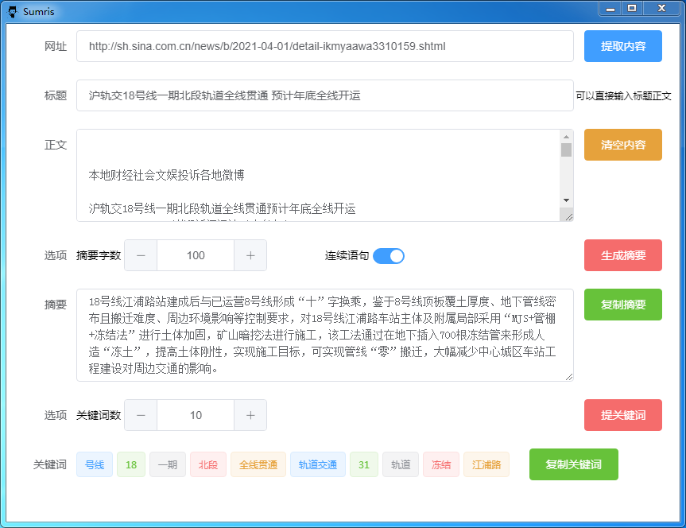

# sumris

自动抽取文章摘要客户端程序，基于[arex](https://gitee.com/dreamidea/arex)实现，arex是一个基于Sentence Rank算法和神经网络的自动文摘项目，本项目将arex打包到electron中运行。





## 依赖
* nodejs: v10.19.0

* electron: 12.0.9

* nodejieba: 2.5.2

## 打包

```shell
npm run build
```

由于使用了nodejieba，build时会重新编译，windows下以上命令打包出来的无法运行，还需要

```shell
./pkg
```

